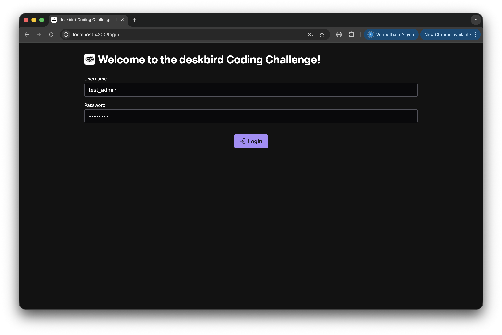
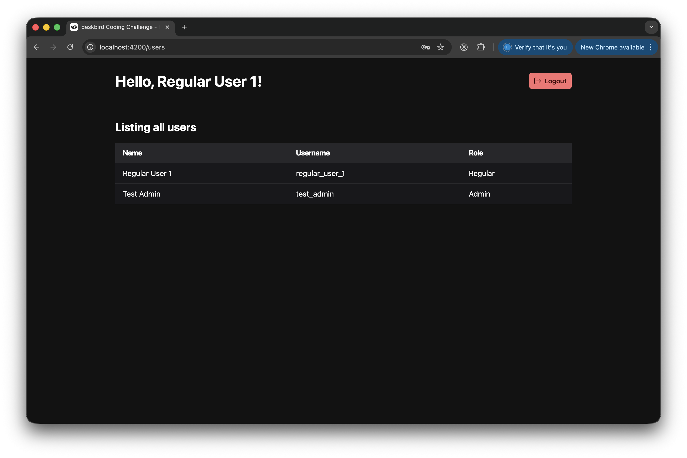
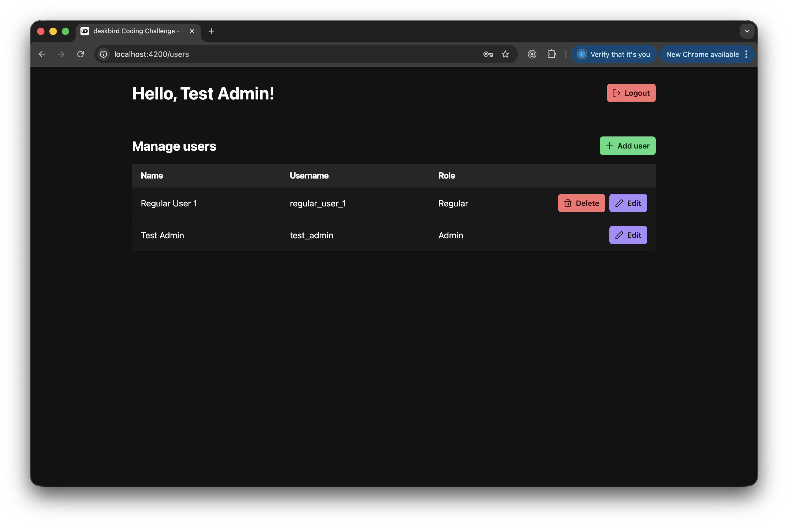
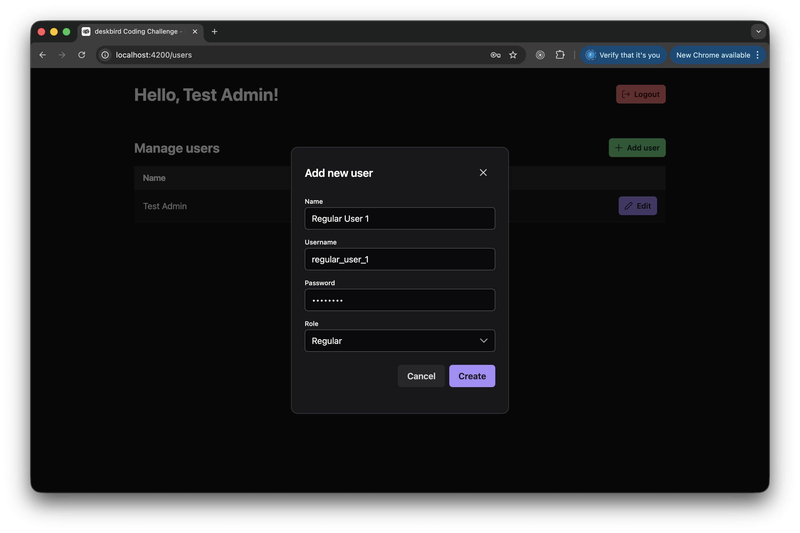
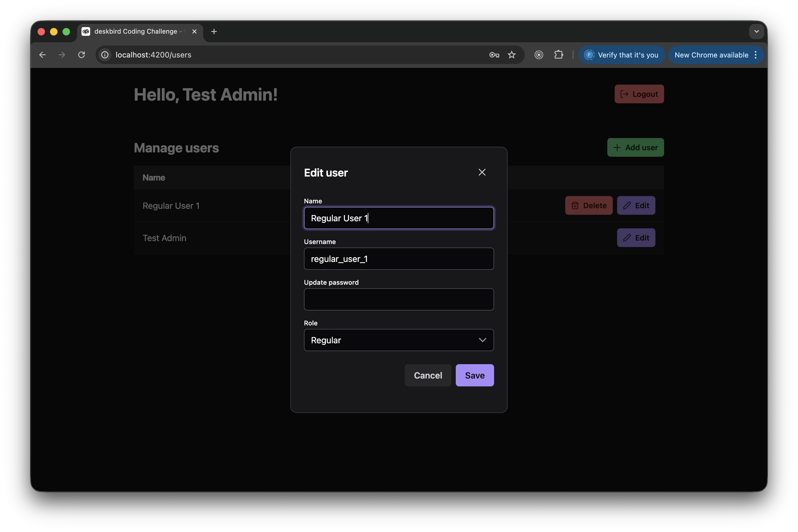
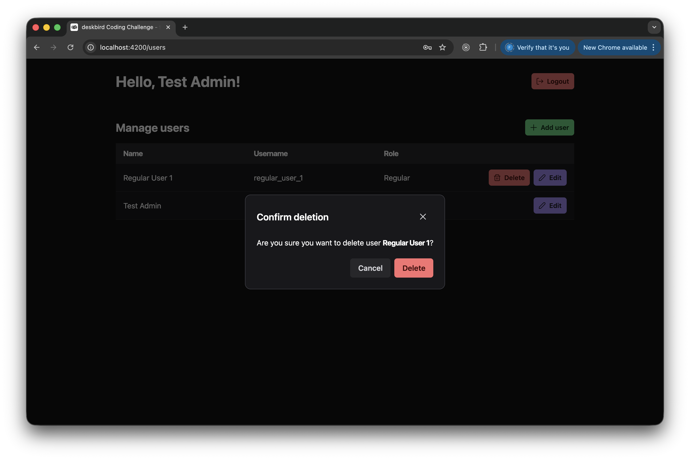

#  deskbird Coding Challenge

Welcome to Filipe Espósito's solution for the _Senior Full-Stack Engineer_ coding challenge by **deskbird**!

On this file you will find all information you need for installing, running and reviewing this project. Here is [a link to the original requirements](./challenge-requirements.pdf).

## Table of contents

- [Project status](#project-status)
- [Technology stack](#technology-stack)
- [Features implemented](#features-implemented)
  - [User management](#user-management)
  - [Authentication & authorization](#authentication--authorization)
  - [Database](#database)
- [Project architecture and overview](#project-architecture-and-overview)
  - [Folder structure](#folder-structure)
- [How to run](#how-to-run)
  - [With a container](#with-a-container)
  - [Without a container](#without-a-container)
  - [Credentials for the admin user](#credentials-for-the-single-admin-user-seeded-on-the-database)
- [API endpoints](#api-endpoints)
  - [Authentication](#authentication)
  - [Users (protected)](#users-protected)
- [Application screenshots](#application-screenshots)
- [Unit testing](#unit-testing)
  - [Readability](#readability)
- [Usage of AI tools](#usage-of-ai-tools)
- [What I would add if I had more time](#what-i-would-add-if-i-had-more-time)

## Project status

✅ **All requirements were met:**
- Technology stack (more details on the next section);
- User CRUD (for non-admins, just a list of users);
- Authentication;
- Role-based access.

## Technology stack

This project contains, as required by **deskbird**, the following technology stack:
- **frontend:** Angular (v20), PrimeNG (and PrimeFlex for CSS utilities), NgRx;
- **backend:** NestJS (v11) and a Postgres (v16) database.

The project was also containerized using [Docker](https://www.docker.com/), which makes it even easier to be run locally when being reviewed, since this project requires a local Postgres database with specific credentials, and contains two applications along with a database seeder.

## Features Implemented

### User management
- ✅ List all users (for both roles)
- ✅ View user details (for both roles)
- ✅ Create new users (admin only)
- ✅ Edit existing users (admin only)
- ✅ Delete users (admin only)

### Authentication & authorization
- ✅ Login/logout functionality
- ✅ Role-based access control (admin vs regular users)
- ✅ Protected routes on frontend
- ✅ Protected endpoints on backend

### Database
- ✅ Postgres database with TypeORM
- ✅ User entity with proper relations
- ✅ Database seeding for admin user

## Project architecture and overview

This is a monorepo generated using [Nx](https://nx.dev/). The architectural decision of using a monorepo was made because of the following benefits:
- Code sharing between apps (such as interfaces from the `/shared-libs` library folder);
- Type safety;
- Atomic changes on both apps at once on each feature-based commit, for example;
- Running both apps at once (required in this case) is much simpler.

### Folder structure

You can find the frontend Angular app under `/apps/frontend`, and the backend NestJS app under `/apps/backend`.

Both the frontend and backend apps have a similar structure regarding the _User_ and _Auth_ features: a `features` folder was added to each app (under `src/app` on the frontend app, and under `src` on the backend app).

On the frontend app, each feature folder contains, at its root level, components that serve as the entry point for that feature (along with services). Then, each subfolder contains the same structure. Each feature folder also contains a `store` folder, where NgRx code related to that feature was added.

On the backend app, each feature folder contains a module, a controller and a service, along with `dto` and `entities` (where applicable) folders. The `database` folder contains only the `DatabaseModule`, which contains the credentials for connecting to the Postgres database. The `seed` folder contains code necessary for populating the database with one admin user.

Also, the `shared-libs` folder was generated in order to share code relevant for both apps. Currently only the `IUser` interface is being shared.

## How to run

After you cloned the repository on your local, you can run the project with or without a Docker container:

### With a container

Run this command if you have Docker installed in your system:

```
docker-compose up --build
```

This command will:
- install a containerized Postgres database (v16);
- install all node modules for both the frontend and backend apps;
- run the database seeder on the backend app;
- run both apps at once.

⚠️ If you get any issues regarding permission and access, run this command on your project root folder:

```
sudo chmod -R 755 .
```

✅ You can then access the frontend app at [`http://localhost:4200`](http://localhost:4200).

### Without a container

1. Run `npm install`.

2. Ensure you have Postgres (v16 and up) installed and running on your local, and with a database called `deskbird`.

3. The BE app requires these credentials for connecting to Postgre:
```
user: postgres
password: 1234
```

4. Run the database seed:
```
nx run backend:seed
```

5. Finally, run both apps at once:
```
npx nx run-many -t serve
```

✅ You can then access the frontend app at [`http://localhost:4200`](http://localhost:4200).

### Credentials for the single admin user seeded on the database

```
username: test_admin
password: admin123
```

## API Endpoints

### Authentication
- `POST /auth/login`: login with username/password;
- `POST /auth/logout`: logout current user.

### Users (protected)
- `GET /users`: list all users (for both roles);
- `GET /users/:id`: get user details (for both roles);
- `POST /users`: create user (admin only);
- `PUT /users/:id`: update user (admin only);
- `DELETE /users/:id`: delete user (admin only).

All `/users` endpoints require authorization.

## Application screenshots

### Login Page


### User list (regular user View)


### User list (admin view)


### Create user (admin only)


### Edit user (admin only)


### Delete user (admin only)


## Unit testing

Jest was used on both apps for running and writing unit tests.

How to run unit tests for each app:
- frontend: `nx test frontend`
- backend: `nx test backend`

On the frontend app, testing the user's interactions with the template was mostly preferred, instead of testing the component's code directly, since the template is the main interface with the user. This was not achieved on all unit test files for time constraints, but was done for presentational purposes on [`logout.spec.ts`](apps/frontend/src/app/features/auth/logout.spec.ts), for example.

### Readability

✅ Each test is designed to be isolated and fully readable independently of outer code (expect for obvious and common setup code placed at the beginning of the file).

✅ Every combination of `describe()` blocks with `it()` test stories under them composes a gramatically correct sentence, in order for the test output to be clear, concise and completely readable.

✅ The unit test stories follow the AAA pattern _(Arrange, Act, Assert)_. In order to meet this pattern, each test story has only two empty lines, which separates the three phases (and no empty lines are added inside each phase, no matter how big they get). Example:
```ts
describe('when the user submits valid credentials', () => {
  it('should call service method for logging in with the correct parameters', () => {
    const username = 'testuser';
    const password = 'testpass';
    component.loginForm.setValue({ username, password });
    authServiceSpy.login.mockReturnValue({ subscribe: jest.fn() });

    component.onSubmit();

    expect(authServiceSpy.login).toHaveBeenCalledWith(username, password);
  });
});
```

## Usage of AI tools

GitHub Copilot was used for consultation, troubleshooting, and generating boilerplate code (Docker setup, test scaffolding). All generated code was reviewed and adapted to project requirements.

## What I would add if I had more time

On both apps:
- Better error handling between frontend and backend for some methods/requests;
- Credentials and API URL info should be moved to a safer place;
- e2e testing. The e2e testing tool of choice would be [Playwright](https://playwright.dev/);
- A unit test coverage tool, with a good minimum coverage threshold.

On the backend app:
- Better checking of user role for the protected operations, such as creating, editing and deleting users.

On the frontend app:
- NgRx for the `user` feature on the frontend app (NgRx was added to the `auth` feature only);
- Improve the current password validator with a set of rules (also containing 'Repeat password');
- Unit tests for NgRx-related code and for `utils` on the frontend;
- Favouring adding component unit tests that start with the template (as mentioned on the [Unit testing](#unit-testing) section), instead of directly testing component code.

## Final thoughts

I hope this solution is to **deskbird**'s liking, as I believe it meets all requirements, and also it showcases some of my skills and experience. It was not only challenging to build it, but also fun. I learned a few more skills, and practiced the existing ones.

Thank you! 🙂

<br />

---

<sub><sup>Made with ❤️ by Filipe Espósito</sub></sup>